# FireMind

> An AI-powered viewing companion that helps Fire TV users discover,
> understand, and interact with entertainment content.

<p align="center">
  
</p>

FireMind is a TV-first Android app built for Fire TV. Instead of endless
scrolling, viewers ask in natural language — "I want a mind-bending
sci-fi movie under two hours" — and get 3–4 recommendations, each with an
explicit explanation of why it matches. Titles can be inspected, saved to
a persistent watchlist, and explored by similar mood.

Built for the **Build, Ship, Shape: Amazon Developer Hackathon** (Fire TV
track).

**Try it in one click:** the debug APK is on the
[Releases page](https://github.com/hamzahmed5/FireMindAmazon/releases/latest)
with step-by-step Fire TV sideload instructions.

## Features

- **Ask FireMind** — natural-language viewing requests, one D-pad press
  away from the home screen
- **Why This?** — every recommendation includes a reason referencing the
  request (mood, runtime, audience)
- **Quick moods** — Funny / Exciting / Family / Sci-Fi / Relaxing / Cozy /
  Mind-bending chips on Home
- **Recommendation results** — small, focused sets (3–4), never endless
  rails; labeled honestly as `AI` or `curated picks`
- **Content details** — metadata, description, watchlist toggle, and
  "recommend something similar"
- **Watchlist** — local persistence (Jetpack DataStore), survives app
  restarts; no account needed
- **Graceful degradation** — if the AI backend is unreachable or fails,
  the app falls back to a deterministic local recommendation engine and
  never leaves the user stranded
- **60-title original catalog** — all fictional metadata, no licensing
  concerns, shared verbatim between app and backend

## Screenshots

All captured from the running app (1920×1080). These are real screencaps,
not mockups. The home and results screens reflect the current Stitch
"Cinematic AI Television" redesign; the classic-capture set is kept below it.

<p align="center">
  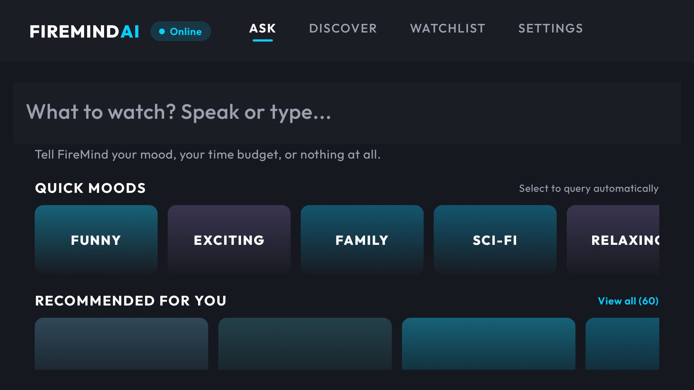
  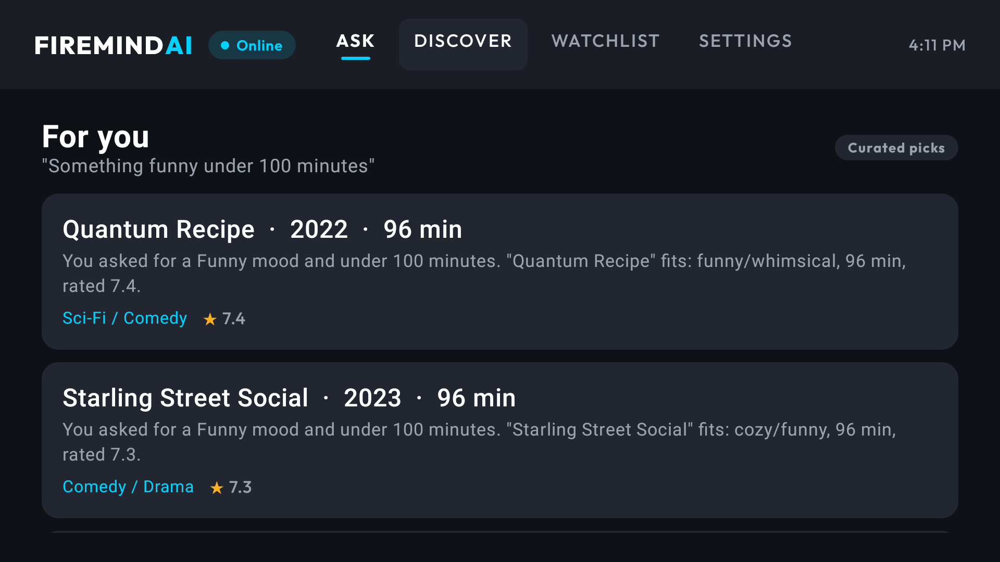
</p>
<p align="center">
  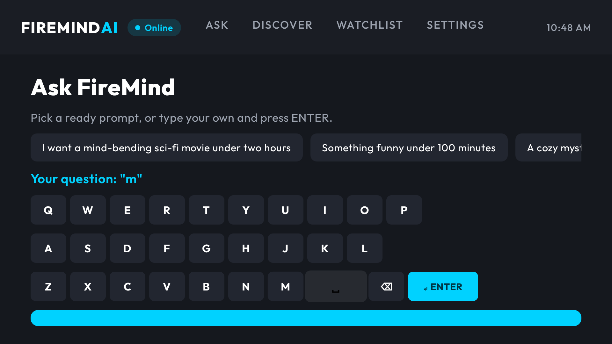
  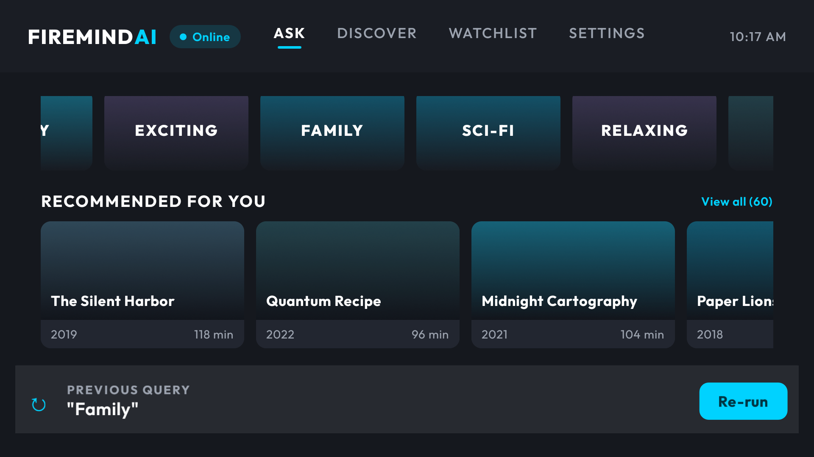
</p>

### More of the current design

<p align="center">
  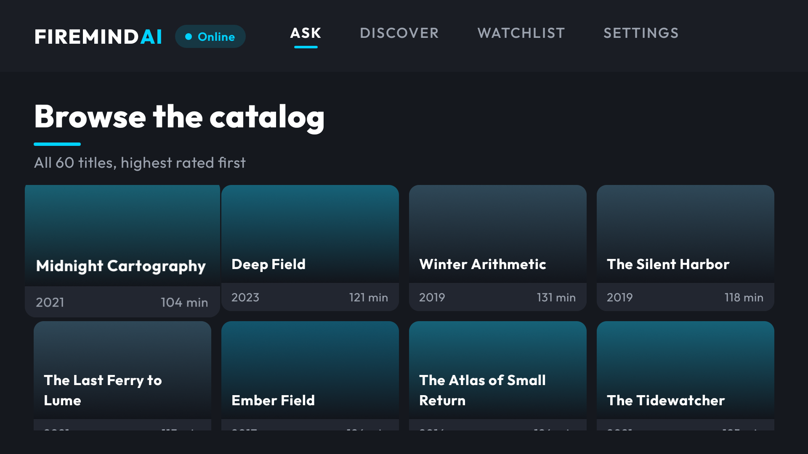
  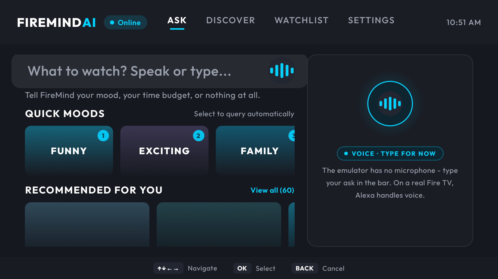
</p>

### Demo videos

- **Full journey (2:45)** — ask → results with reasons → details →
  watchlist → app restart → watchlist persists:
  [`docs/demo-video.mp4`](docs/demo-video.mp4) (H.264, 5.5 MB)
- **Results scroll (30s)** — slow pass across the recommendation cards
  with every reason visible:
  [`docs/results-scroll.mp4`](docs/results-scroll.mp4) (H.264, 1 MB)

## Architecture

```text
+----------------------+         +---------------------------+
|      Fire TV App     |  HTTPS  | FireMind Backend          |
| Android / Kotlin     | ------> | Node.js (zero deps)       |
| Jetpack Compose TV   |  JSON   |  - /api/recommend         |
| D-pad navigation     | <------ |  - /api/summarize         |
+----------------------+         |  - /api/similar           |
                                 |  - /api/health            |
                                 +------------+--------------+
                                              |
                                              v
                                 +---------------------------+
                                 | Amazon Bedrock (Converse) |
                                 | SigV4-signed, env-var     |
                                 | credentials only          |
                                 +---------------------------+
```

- The **app** never parses model prose: the backend validates the AI JSON
  contract against the catalog (ids must exist, shape must match) before
  responding.
- The **backend** falls back to the same deterministic ranking the app
  uses locally, so behavior is identical with or without AI.
- Secrets live only in environment variables. Nothing is hardcoded.

See [docs/ARCHITECTURE.md](docs/ARCHITECTURE.md) and
[docs/API_SPEC.md](docs/API_SPEC.md).

## Tech Stack

| Layer | Technology |
|---|---|
| App | Kotlin, Jetpack Compose for TV (`androidx.tv:tv-material`), Navigation Compose, ViewModel, DataStore |
| Build | Gradle 8.x, Android Gradle Plugin 8.x, compileSdk 36, minSdk 23 |
| Backend | Node.js ≥ 20, zero npm dependencies, stdlib `http` |
| AI | Amazon Bedrock Converse API (SigV4 implemented natively, no AWS SDK) |
| Tests | 94 automated tests — 62 backend (Node built-in runner) + 32 app unit tests (JUnit, no device needed) — plus adb/uiautomator-driven D-pad and screen verification |

## Requirements

- JDK 17+ (tested with OpenJDK 21)
- Android SDK with `platforms;android-36` (35+ works)
- Node.js 20+ for the backend
- For running: a Fire TV device (USB/ADB debugging enabled) **or** an
  Android TV emulator (`tv_1080p` device profile works well)

## Setup

```bash
git clone https://github.com/hamzahmed5/FireMindAmazon.git
cd FireMindAmazon
```

Create `local.properties` in the repo root (or set `ANDROID_HOME`):

```properties
sdk.dir=C\:\\path\\to\\android-sdk
```

## Backend Setup

```bash
cd backend
npm test        # 62 unit + integration tests
npm start       # listens on :8080 by default
```

Environment variables (all optional — the server runs without AI):

| Variable | Purpose | Default |
|---|---|---|
| `PORT` | HTTP port | `8080` |
| `AWS_REGION` | Bedrock region | `us-east-1` |
| `BEDROCK_MODEL_ID` | Model for Converse API (newer Anthropic models need the `us.` / `global.` inference-profile prefix; the old `claude-3-haiku` was retired) | `us.anthropic.claude-haiku-4-5-20251001-v1:0` |
| `AWS_ACCESS_KEY_ID` | AWS credential (never committed) | unset |
| `AWS_SECRET_ACCESS_KEY` | AWS credential (never committed) | unset |
| `AWS_SESSION_TOKEN` | For temporary credentials | unset |
| `BEDROCK_TIMEOUT_MS` | AI call timeout | `12000` |

**Without AWS credentials the backend still works** — every endpoint
serves deterministic, tested recommendations. With credentials, Bedrock
generates reasons and summaries; any AI failure falls back automatically.

### Live console

Start the server and open **http://localhost:8080/** in a browser. The
server serves a small zero-dependency page (no build step, no framework)
that reports `/api/health` and runs `/api/recommend` from the page itself.
Each answer carries the same badge the TV app shows — **AI · Amazon
Bedrock** when the model answered, **Local · deterministic fallback** when
it did not — so "is AI live right now?" is one page load instead of a log
dig. It is served from the API's own origin, so there is no CORS setup to
get wrong. The same page is served by the AWS deployment, so a cloud
backend can be watched in a browser too.

### Deploy it to AWS (optional)

The backend also runs on AWS, unchanged, as **API Gateway → Lambda → Bedrock**:

```bash
aws login                                # credentials with IAM + Lambda + API GW rights
node tools/deploy-aws.mjs                # creates/updates everything, prints the URL
node tools/deploy-aws.mjs --package-only # just build the zip, touch nothing in AWS
```

The function runs under an IAM role whose only permission is
`bedrock:InvokeModel`, so **no AWS keys are stored in AWS** and the hourly
`aws login` refresh that the laptop setup needs does not apply in the cloud.
The account's Bedrock quota still does. The public URL is throttled
(5 req/s, burst 10) with concurrency capped, so it cannot run up a bill.
Point the app at it with `FIREMIND_BACKEND_URL="https://..."`. Full details,
the console click-path, and cleanup commands: **[docs/DEPLOY_AWS.md](docs/DEPLOY_AWS.md)**.

See `backend/.env.example`.

## AI Configuration

The backend uses the Bedrock **Converse** API (`POST
/model/{modelId}/converse`), which is model-agnostic — swap
`BEDROCK_MODEL_ID` without code changes. Requests are SigV4-signed in
`backend/lib/bedrock.js` using only `node:crypto`; there is no AWS SDK
dependency and no credential ever touches the client app.

`backend/.env` is loaded automatically at startup, and a real shell
variable always wins over the file. The server logs which variable
**names** it took from it — never the values:

```bash
cp backend/.env.example backend/.env   # then fill in credentials
cd backend && npm start
# [firemind] AI mode: Bedrock (us.anthropic.claude-haiku-4-5-20251001-v1:0)
# [firemind] loaded from backend/.env: AWS_ACCESS_KEY_ID, AWS_SECRET_ACCESS_KEY, ...
```

IAM policy needed: `bedrock:InvokeModel` on the chosen model **and** on the
`inference-profile/*` ARN (newer Anthropic models are invoked through a
profile, not the bare model id — see `docs/DEPLOY_AWS.md`).

## Fire TV Build

```bash
./gradlew assembleDebug
# Windows PowerShell:
.\gradlew.bat assembleDebug
```

APK output: `app/build/outputs/apk/debug/app-debug.apk` (~14 MB)

Release build (minified, resource-shrunk):

```bash
./gradlew assembleRelease
```

## Fire TV Installation

Enable ADB debugging on the Fire TV (Settings → Device & Software →
Developer Options), then:

```bash
adb connect <FIRE_TV_IP>:5555
adb install -r app/build/outputs/apk/debug/app-debug.apk
```

Or sideload without a computer using the APK from the
[Releases page](https://github.com/hamzahmed5/FireMindAmazon/releases/latest)
and the free **Downloader** app — the release notes walk through it.

On an Android TV emulator (used during development):

```bash
avdmanager create avd -n firetv_demo -k "system-images;android-33;android-tv;x86" -d tv_1080p
emulator -avd firetv_demo
adb install -r app/build/outputs/apk/debug/app-debug.apk
```

## Running the App

Launch FireMind from the TV launcher (it appears under Your Apps), or:

```bash
adb shell am start -n com.firemind.app.debug/com.firemind.app.MainActivity
```

The app expects the backend at `http://10.0.2.2:8080` (emulator → host
loopback) or `http://<HOST_LAN_IP>:8080` on real devices. Override at
build time without code changes:

```bash
FIREMIND_BACKEND_URL="http://192.168.1.20:8080" ./gradlew assembleDebug
```

Cleartext HTTP is permitted **only** for explicitly listed local dev hosts
in `app/src/main/res/xml/network_security_config.xml` (loopback, `10.0.2.2`,
plus one LAN address used for physical-device testing). Add your own host
there before pointing a real device at it — Android blocks unlisted hosts,
which presents as "the backend is down" rather than as a config error.
Production should serve HTTPS.

## Tests

Both suites run without an emulator or a TV attached.

App unit tests (32 tests — engine intent parsing, ranking, reason strings,
similar titles, catalog integrity):

```bash
./gradlew testDebugUnitTest
# HTML report: app/build/reports/tests/testDebugUnitTest/index.html
```

Live Bedrock state (one real Converse call; safe to run any time — prints
a verdict and never prints secrets):

```bash
cd backend && node tools/live-check.mjs
```

Backend tests (62 tests — engine, HTTP contract, validation, error paths,
the signed Bedrock request path, the `.env` loader, and every AI degradation
path):

```bash
cd backend && npm test
```

The Bedrock tests stand up a local stub that speaks the Converse API, so the
real orchestrator and the real signer run end to end without AWS
credentials: the arriving request is asserted to be correctly signed and
shaped, and a 500, prose, or empty model response must each degrade to
deterministic picks rather than surfacing an error.

Signature correctness is pinned against **AWS's own signer**: a known-answer
test asserts the exact signature botocore produces for the identical
request. Re-derive that value with (botocore is deliberately *not* a project
dependency):

```bash
pip install botocore
python backend/tools/sigv4-oracle.py --json | node backend/tools/sigv4-crosscheck.mjs
```

Because the app's offline engine and the backend's fallback engine
implement the same behavior in two languages, both suites assert the same
expectations (spelled-out runtimes, mood and genre intent, audience
filtering, reason wording). Changing one engine means mirroring the change
and its tests in the other.

## Demo

Demo video: [`docs/demo-video.mp4`](docs/demo-video.mp4) — 2:45, captured
from the Fire OS 7 emulator, H.264.

Demo flow: launch → Ask FireMind → "I want a mind-bending sci-fi movie
under two hours" → results with reasons → details → add to watchlist →
restart app → watchlist persists. Shot-by-shot narration:
[docs/DEMO_SCRIPT.md](docs/DEMO_SCRIPT.md).

## Fire OS compatibility runs

Fire OS 7 is Android 9 (API 28) and Fire OS 8 is Android 11 (API 30). The
current build was installed and driven on both; the captures below are from
today's runs, showing the current design on each Fire OS version:

| Fire OS 7 (API 28) | Fire OS 8 (API 30) |
|---|---|
| 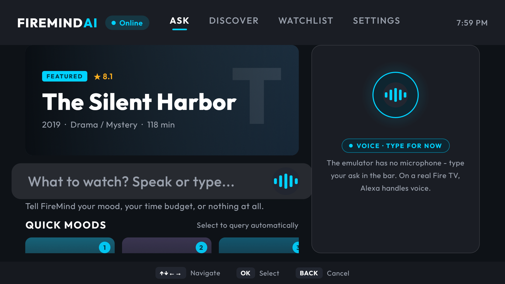 |  |

The whole check is repeatable — this is the mechanism behind the rows
above, not a one-off manual session:

```bash
tools/verify-fireos.sh              # static APK audit + both Fire OS AVDs
tools/verify-fireos.sh --avd firetv7   # one AVD
tools/verify-fireos.sh --static-only   # no emulator
```

It installs the APK, drives the journey with D-pad key events (Home → chip
→ Results → Details → watchlist toggle), reads the app's own DataStore file
to prove the title was **written to disk**, force-stops and relaunches to
prove it **survives**, and fails on any crash-buffer entry. It clears app
data first, so a file left behind by an earlier run cannot make the
persistence checks pass on their own.

### Physical device run

Installed and run on a real **Samsung Galaxy A55 (Android 16, arm64)** over
USB — not an emulator. Leanback is declared *optional*, so the app installs
on handhelds, which is what makes this check possible without a TV in the
room. For the run the phone was set to **TV geometry** — `wm size 1920x1080`
with TV density (320 dpi), the logical resolution and text scale of a
1080p television — and its original settings were restored afterwards. So
these are 10-foot-UI captures of the current design, not phone-shaped
approximations, and they were taken against the live backend over LAN.

| Home | Ask FireMind | Results |
|---|---|---|
| 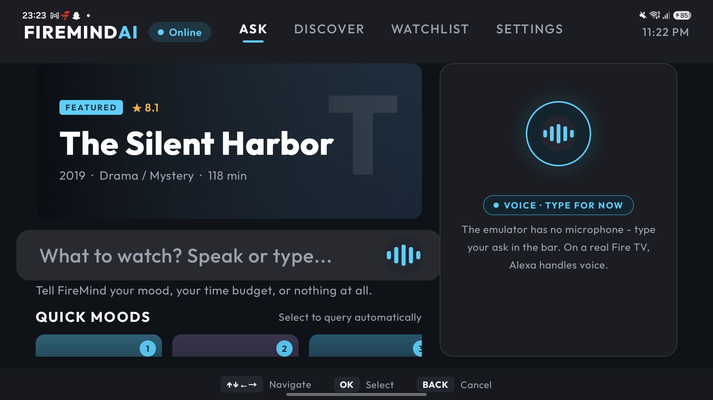 | 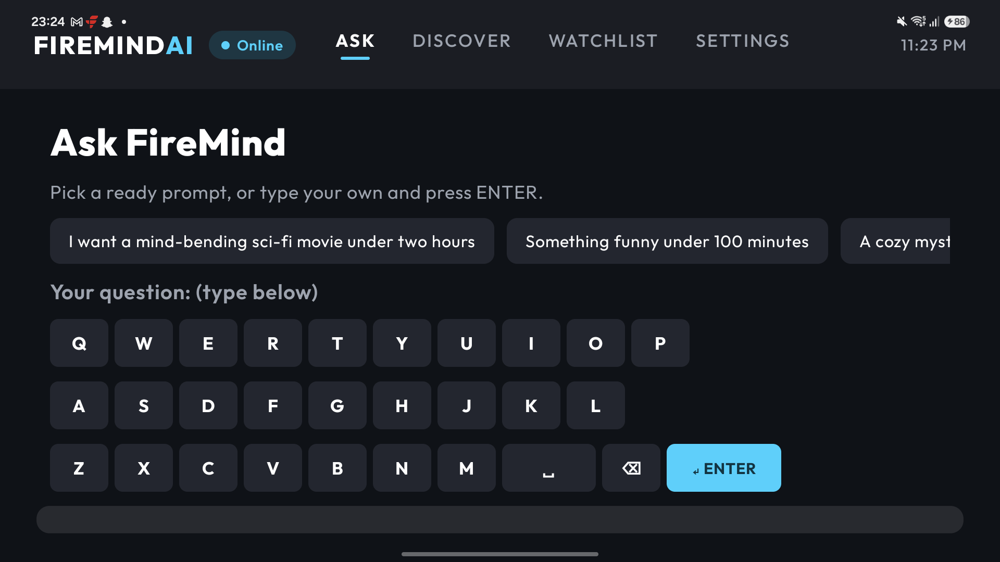 | 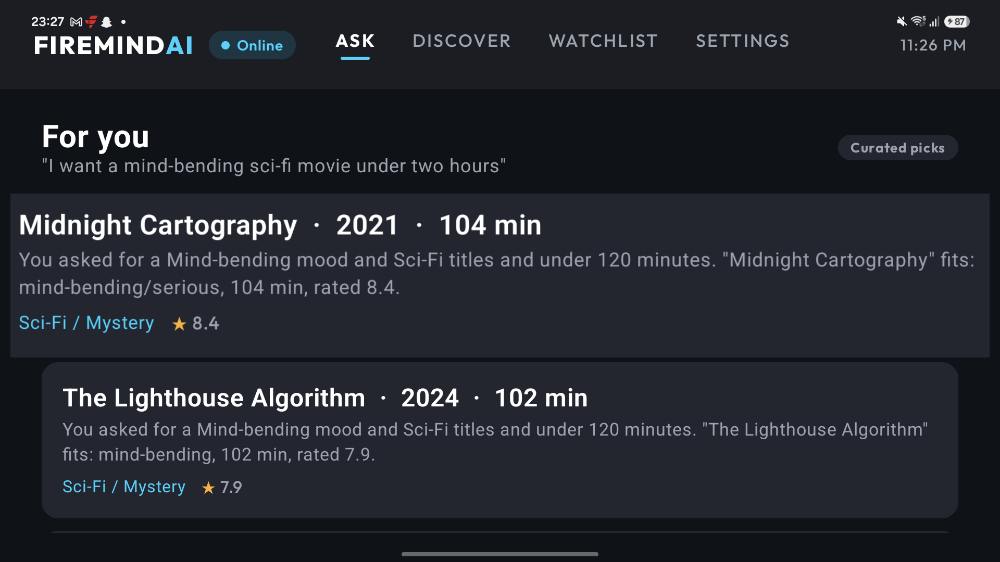 |

| Details | Watchlist | About — live backend |
|---|---|---|
| 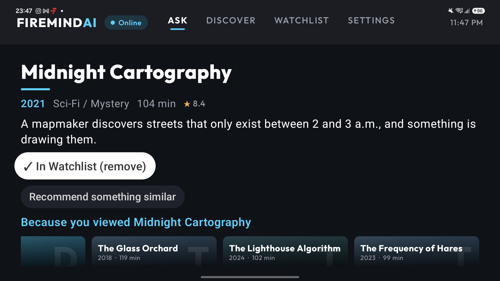 | 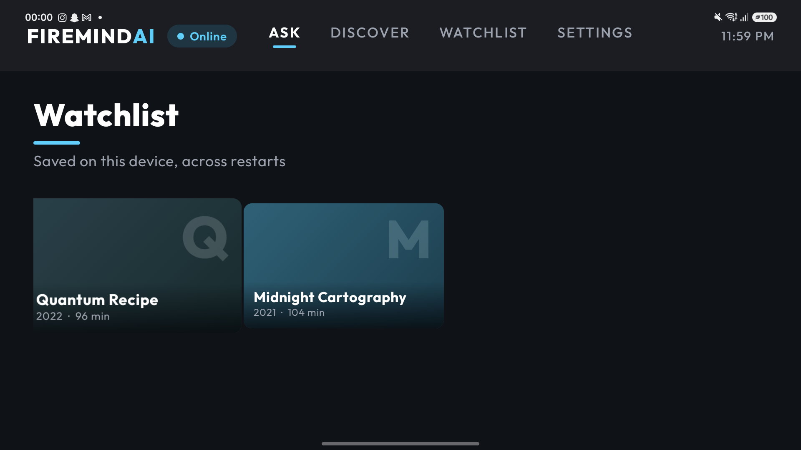 | 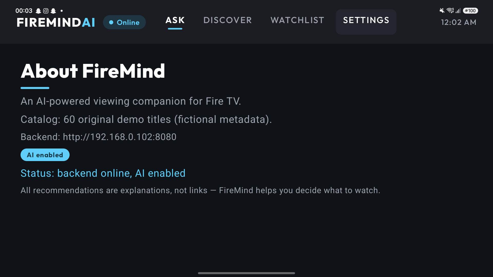 |

Driven entirely over adb with D-pad key events: Home → Ask → prompt chip →
Results → Details → **Add to Watchlist** (the button then reads "✓ In
Watchlist (remove)") → Watchlist showing the saved title. About reads
**"AI enabled"** against the live backend at `http://192.168.0.102:8080` —
the device reaching the backend across the LAN. An earlier run also proved
the saved title **survived a `force-stop` and relaunch**
(`phone-07-watchlist-after-restart.png`).

Two caveats, stated plainly: this is **Android, not Fire OS**, so it is
real-hardware evidence for rendering, navigation, networking, persistence
and crash-freedom — but **not** Fire TV validation; and **touch does not
activate the controls**: `input tap` produced no reaction at any
coordinate, while D-pad events drove everything, and a control test
confirmed that tapping *does* work on the phone by opening the Camera app
from the launcher.

## Verified Behavior

Everything below was confirmed by running the installed app on a TV
emulator, not inferred from source:

| Check | Result |
|---|---|
| Debug build | `BUILD SUCCESSFUL`, APK produced (~14 MB) |
| Launch | Window focus on `MainActivity`, 1.4–1.7 s, 0 `FATAL` lines in logcat |
| D-pad journey | Home → Ask → prompt → Results → Details → Watchlist, all remote-only |
| Back navigation | Pops the nav stack correctly at every step |
| Runtime constraint | "under two hours" → results of 96 / 102 / 104 min (no over-cap leak) |
| Watchlist persistence | Survives `force-stop` and relaunch; DataStore file on disk |
| Device → backend HTTP | About screen reports "backend online" via `10.0.2.2:8080` |
| Backend | 62/62 tests pass (`npm test`), live health + recommend verified over HTTP |
| App unit tests | 32/32 pass (`./gradlew testDebugUnitTest`) — engine intent parsing, ranking, reason strings, similar titles, catalog integrity |
| Engine parity | Mood and genre synonym tables verified identical between the Kotlin and JavaScript engines |
| Genre chips | Tapping **Sci-Fi** returns only sci-fi titles; tapping **Family** returns only family-friendly titles (verified on device against the catalog data) |

## Project Structure

```text
FireMindAmazon/
├── app/                        # Android TV app (Kotlin + Compose TV)
│   └── src/main/
│       ├── assets/catalog.json # 60-title original catalog (source of truth)
│       └── java/com/firemind/app/
│           ├── MainActivity.kt
│           ├── FireMindViewModel.kt     # AI-first, fallback-second flow
│           ├── ai/FireMindClient.kt     # Backend HTTP client
│           ├── data/                    # repository, watchlist, models
│           └── ui/                      # home, assistant, results, details, browse, watchlist, settings
├── backend/                    # Zero-dependency Node server
│   ├── server.js               # local HTTP transport
│   ├── lambda.mjs              # API Gateway -> Lambda transport
│   ├── lib/router.js           # the routing both transports share
│   ├── lib/bedrock.js          # native SigV4 + Bedrock Converse
│   ├── lib/ai.js               # prompt design + JSON contract validation
│   ├── lib/catalog.js          # deterministic recommendation engine
│   ├── lib/console.js          # browser console served at /
│   ├── lib/env.js              # .env loading + port resolution
│   └── test/                   # 62 unit + integration tests
├── data/catalog.json           # catalog copy served by the backend
├── docs/                       # API spec, architecture, deploy guide, friction log
│   ├── demo-video.mp4          # 2:45 demo journey (H.264)
│   └── results-scroll.mp4      # 30s results-screen scroll clip
└── tools/
    ├── gen_assets.py           # original asset generator (icons/banner)
    ├── verify-fireos.sh        # repeatable Fire OS 7/8 emulator check
    └── deploy-aws.mjs          # Lambda + API Gateway deployment
```

## Environment Variables

See [Backend Setup](#backend-setup). The app has no secrets; its only
config is the backend URL (build-time, `FIREMIND_BACKEND_URL`).

## Known Limitations

Stated plainly, so nothing here is overclaimed:

1. **Bedrock is live-configured; the account quota is the last gate.** Real
   requests reach AWS with valid signatures and model ids. What blocks an
   end-to-end AI answer today is the account-level **daily token quota**,
   which `aws service-quotas` reports as 0 for every Bedrock model on an
   account without a payment instrument — so it does not reset with time.
   The default model was also found retired (Claude 3 Haiku EOL) and is now
   `us.anthropic.claude-haiku-4-5-20251001-v1:0`; the full chain — expired
   creds → model EOL → inference-profile requirement → 0-token quota — is
   documented in [docs/FRICTION_LOG.md](docs/FRICTION_LOG.md) (F31). Once
   billing is set up on the AWS account, AI answers flow with **zero code
   changes**. Until then the backend serves the tested deterministic path —
   by design, the product never dead-ends — and the UI says so honestly.
2. **Validated on Fire OS-equivalent emulators, not Fire TV hardware.**
   The app was installed, launched and driven on Android TV images at API
   28 (Fire OS 7) and API 30 (Fire OS 8), including a run with Google Play
   services disabled to approximate Fire OS. Its dependency graph contains
   no Play services at all, and it requests only INTERNET and
   ACCESS_NETWORK_STATE. A physical *Android phone* run was also completed
   (see Screenshots) — real hardware, real LAN, real crashes-if-any — but
   it is not a Fire TV and is not counted as one.
3. **The release APK is unsigned.** `assembleRelease` produces
   `app-release-unsigned.apk`. The shipped **debug** APK is signed with the
   debug key; real distribution needs your own release signing key.
4. **The two recommendation engines are kept in sync by hand.** The app
   (Kotlin) and backend (JavaScript) implement the same intent parsing and
   ranking, and both suites assert the same expectations (32 app tests,
   62 backend tests), but nothing enforces the parity automatically —
   changing one engine requires mirroring the change in the other. The
   tables were verified identical when this was written.
5. **Single-locale (English) strings**, and the catalog is a fixed set of
   60 original fictional titles.
6. **The UI is focus/D-pad driven and ignores touch.** On the physical
   phone, `input tap` at coordinates taken directly from `uiautomator`
   bounds produced no reaction anywhere (rail, buttons, cards) at two
   different display geometries, while D-pad key events drove every
   screen; a control test confirmed tapping works on the device itself.
   This is correct for a TV app, and the manifest declares leanback
   optional only so the build installs on handhelds for development — but
   it means the app is not touch-operable if it is ever shipped to a
   tablet or phone. The underlying cause (Compose touch dispatch versus
   the focus-first TV components) was not isolated.
7. **No authentication on the backend.** It is meant to run on a trusted
   local network for the demo; do not expose it publicly as-is.

## Troubleshooting

- **App shows "curated picks" instead of AI** — backend has no AWS
  credentials or the model call failed; check backend console logs
  (`[firemind] AI recommend failed...`).
- **Backend unreachable from a real device** — use the host's LAN IP,
  not `localhost`; add it to `network_security_config.xml` if using
  cleartext HTTP during development.
- **Emulator has no network to host** — `10.0.2.2` maps to the host on
  AVDs; on Fire TV hardware use the actual LAN IP.
- **Gradle can't find the SDK** — set `sdk.dir` in `local.properties` or
  export `ANDROID_HOME`.
- **Bedrock returns 400 "on-demand throughput isn't supported"** — the
  model id needs its `us.` / `global.` inference-profile prefix.
- **Bedrock returns 429 "Too many tokens per day" that never clears** —
  check `aws service-quotas list-service-quotas --service-code bedrock`;
  a 0.0 daily-token value means the account needs billing setup, not
  waiting.

## Product Feedback / Friction Log

- [docs/FRICTION_LOG.md](docs/FRICTION_LOG.md) — real obstacles hit while
  building, with root causes and workarounds
- [docs/PRODUCT_FEEDBACK.md](docs/PRODUCT_FEEDBACK.md) — per-tool feedback
  for the Amazon/Android developer tools used

## License

MIT — see [LICENSE](LICENSE).
