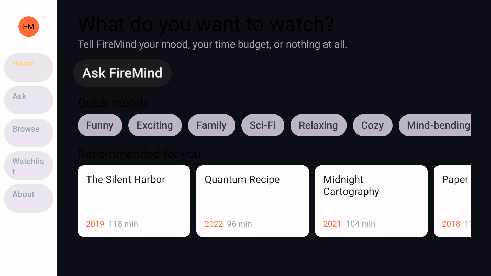
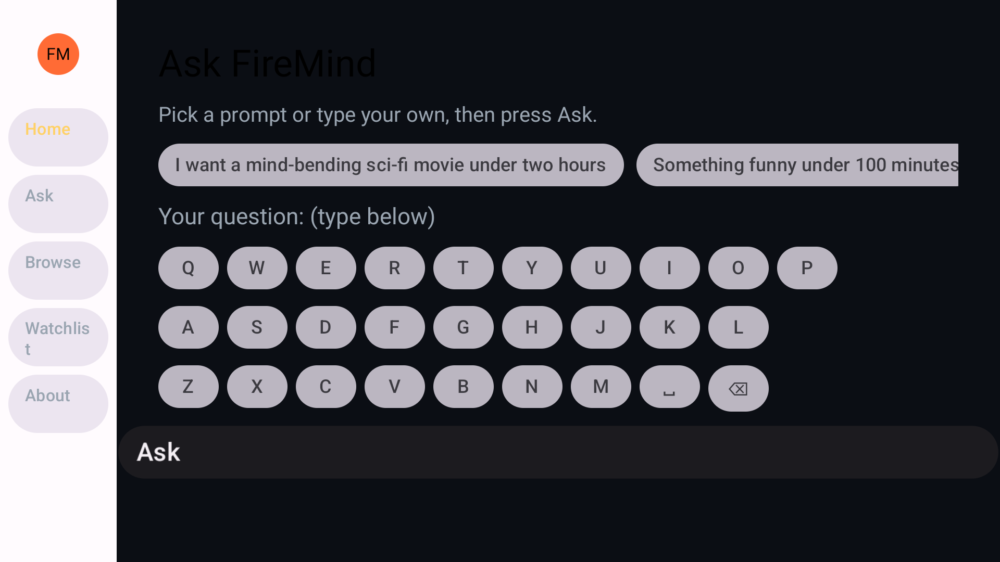
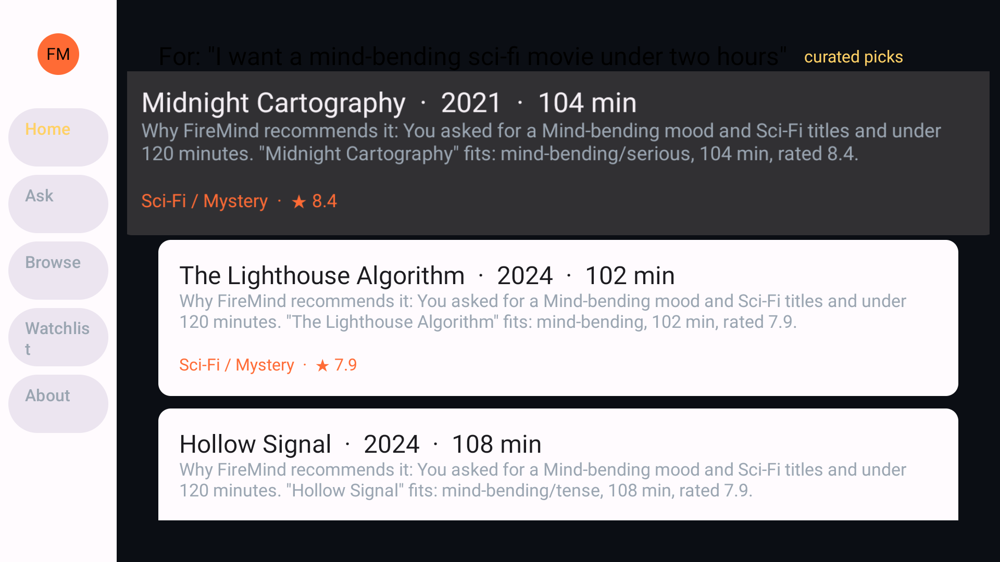
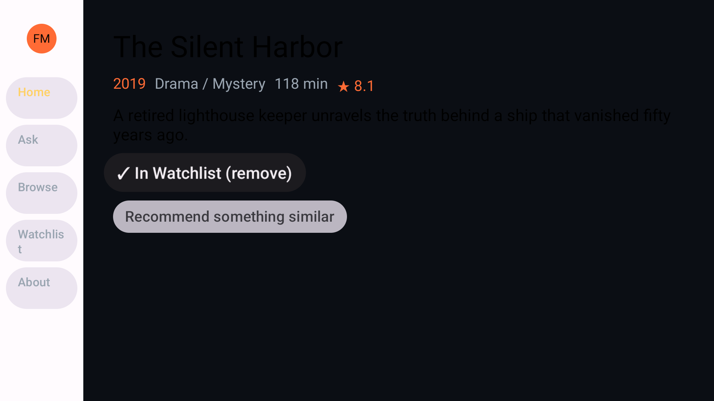
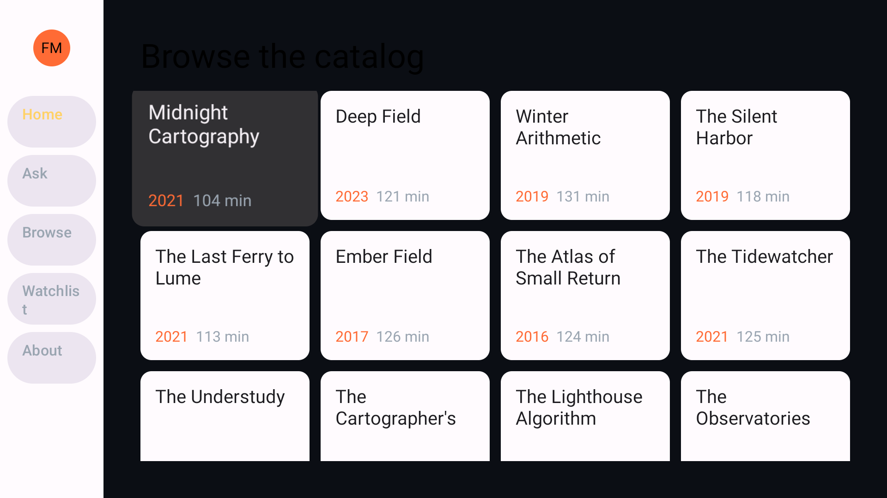
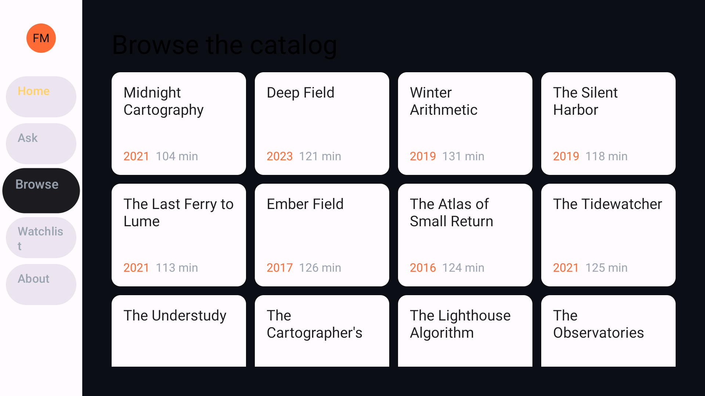
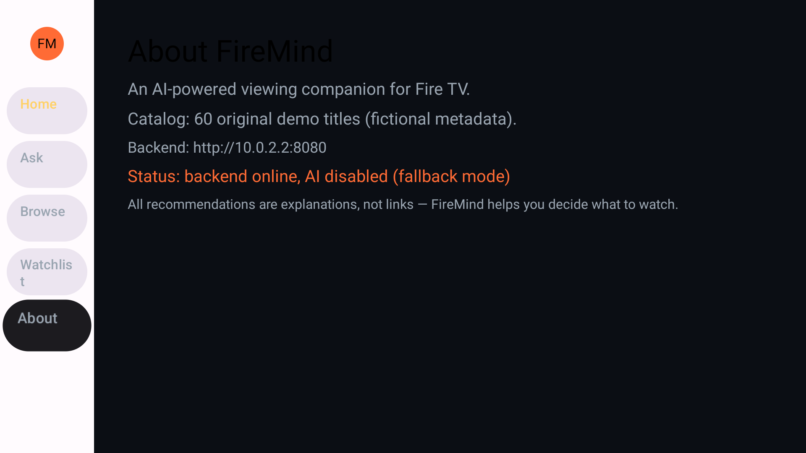

# FireMind

> An AI-powered viewing companion that helps Fire TV users discover,
> understand, and interact with entertainment content.

FireMind is a TV-first Android app built for Fire TV. Instead of endless
scrolling, viewers ask in natural language — "I want a mind-bending
sci-fi movie under two hours" — and get 3–4 recommendations, each with an
explicit explanation of why it matches. Titles can be inspected, saved to
a persistent watchlist, and explored by similar mood.

Built for the **Build, Ship, Shape: Amazon Developer Hackathon** (Fire TV
track).

## Features

- **Ask FireMind** — natural-language viewing requests, one D-pad press
  away from the home screen
- **Why This?** — every recommendation includes a reason referencing the
  request (mood, runtime, audience)
- **Quick moods** — Funny / Exciting / Family / Sci-Fi / Relaxing / Cozy /
  Mind-bending chips on Home
- **Recommendation results** — small, focused sets (3–4), never endless
  rails; labeled honestly as `AI` or `curated picks`
- **Content details** — metadata, description, watchlist toggle, and
  "recommend something similar"
- **Watchlist** — local persistence (Jetpack DataStore), survives app
  restarts; no account needed
- **Graceful degradation** — if the AI backend is unreachable or fails,
  the app falls back to a deterministic local recommendation engine and
  never leaves the user stranded
- **60-title original catalog** — all fictional metadata, no licensing
  concerns, shared verbatim between app and backend

## Architecture

```text
+----------------------+         +---------------------------+
|      Fire TV App     |  HTTPS  | FireMind Backend          |
| Android / Kotlin     | ------> | Node.js (zero deps)       |
| Jetpack Compose TV   |  JSON   |  - /api/recommend         |
| D-pad navigation     | <------ |  - /api/summarize         |
+----------------------+         |  - /api/similar           |
                                 |  - /api/health            |
                                 +------------+--------------+
                                              |
                                              v
                                 +---------------------------+
                                 | Amazon Bedrock (Converse) |
                                 | SigV4-signed, env-var     |
                                 | credentials only          |
                                 +---------------------------+
```

- The **app** never parses model prose: the backend validates the AI JSON
  contract against the catalog (ids must exist, shape must match) before
  responding.
- The **backend** falls back to the same deterministic ranking the app
  uses locally, so behavior is identical with or without AI.
- Secrets live only in environment variables. Nothing is hardcoded.

See [docs/ARCHITECTURE.md](docs/ARCHITECTURE.md) and
[docs/API_SPEC.md](docs/API_SPEC.md).

## Tech Stack

| Layer | Technology |
|---|---|
| App | Kotlin 2.4, Jetpack Compose for TV (`androidx.tv:tv-material` 1.1), Navigation Compose, ViewModel, DataStore |
| Build | Gradle 8.14.5, Android Gradle Plugin 8.13.2, compileSdk 36, minSdk 23 |
| Backend | Node.js ≥ 20, zero npm dependencies, stdlib `http` |
| AI | Amazon Bedrock Converse API (SigV4 implemented natively, no AWS SDK) |
| Tests | 53 automated tests — 21 backend (Node built-in runner) + 32 app unit tests (JUnit, no device needed) — plus adb/uiautomator-driven D-pad and screen verification |

## Requirements

- JDK 17+ (tested with OpenJDK 21)
- Android SDK with `platforms;android-35` or newer (tested with 35 and 36)
- Node.js 20+ for the backend (tested with Node 24)
- For running: a Fire TV device (USB/ADB debugging enabled) **or** an
  Android TV emulator (`tv_1080p` device profile works well)

## Setup

```bash
git clone <REPOSITORY_URL>
cd firemind
```

Create `local.properties` in the repo root (or set `ANDROID_HOME`):

```properties
sdk.dir=C\:\\path\\to\\android-sdk
```

## Backend Setup

```bash
cd backend
npm test        # 15 unit + integration tests
npm start       # listens on :8080 by default
```

Environment variables (all optional — the server runs without AI):

| Variable | Purpose | Default |
|---|---|---|
| `PORT` | HTTP port | `8080` |
| `AWS_REGION` | Bedrock region | `us-east-1` |
| `BEDROCK_MODEL_ID` | Model for Converse API | `anthropic.claude-3-haiku-20240307-v1:0` |
| `AWS_ACCESS_KEY_ID` | AWS credential (never committed) | unset |
| `AWS_SECRET_ACCESS_KEY` | AWS credential (never committed) | unset |
| `AWS_SESSION_TOKEN` | For temporary credentials | unset |
| `BEDROCK_TIMEOUT_MS` | AI call timeout | `12000` |

**Without AWS credentials the backend still works** — every endpoint
serves deterministic, tested recommendations. With credentials, Bedrock
generates reasons and summaries; any AI failure falls back automatically.

See `backend/.env.example`.

## AI Configuration

The backend uses the Bedrock **Converse** API (`POST
/model/{modelId}/converse`), which is model-agnostic — swap
`BEDROCK_MODEL_ID` without code changes. Requests are SigV4-signed in
`backend/lib/bedrock.js` using only `node:crypto`; there is no AWS SDK
dependency and no credential ever touches the client app.

IAM policy needed: `bedrock:InvokeModel` on the chosen model.

## Fire TV Build

```bash
./gradlew assembleDebug
# Windows PowerShell:
.\gradlew.bat assembleDebug
```

APK output: `app/build/outputs/apk/debug/app-debug.apk`

Release build (minified, resource-shrunk):

```bash
./gradlew assembleRelease
```

## Fire TV Installation

Enable ADB debugging on the Fire TV (Settings → Device & Software →
Developer Options), then:

```bash
adb connect <FIRE_TV_IP>:5555
adb install -r app/build/outputs/apk/debug/app-debug.apk
```

Or on an Android TV emulator (used during development):

```bash
avdmanager create avd -n firetv_demo -k "system-images;android-33;android-tv;x86" -d tv_1080p
emulator -avd firetv_demo
adb install -r app/build/outputs/apk/debug/app-debug.apk
```

## Running the App

Launch FireMind from the TV launcher (it appears under Your Apps), or:

```bash
adb shell am start -n com.firemind.app/com.firemind.app.MainActivity
```

The app expects the backend at `http://10.0.2.2:8080` (emulator → host
loopback) or `http://<HOST_LAN_IP>:8080` on real devices. Override at
build time without code changes:

```bash
FIREMIND_BACKEND_URL="http://192.168.1.20:8080" ./gradlew assembleDebug
```

Cleartext HTTP is permitted **only** for loopback/`10.0.2.2` dev hosts
via the network security config; production should serve HTTPS.

## Tests

Both suites run without an emulator or a TV attached.

App unit tests (32 tests — engine intent parsing, ranking, reason strings,
similar titles, catalog integrity):

```bash
./gradlew testDebugUnitTest
# HTML report: app/build/reports/tests/testDebugUnitTest/index.html
```

Backend tests (39 tests — engine, HTTP contract, validation, error paths,
the signed Bedrock request path, and every AI degradation path):

```bash
cd backend && npm test
```

The Bedrock tests stand up a local stub that speaks the Converse API, so the
real orchestrator and the real signer run end to end without AWS
credentials: the arriving request is asserted to be correctly signed and
shaped, and a 500, prose, or empty model response must each degrade to
deterministic picks rather than surfacing an error.

Signature correctness is pinned against **AWS's own signer**: a known-answer
test asserts the exact signature botocore produces for the identical
request. Re-derive that value with (botocore is deliberately *not* a project
dependency):

```bash
pip install botocore
python backend/tools/sigv4-oracle.py --json | node backend/tools/sigv4-crosscheck.mjs
```

Because the app's offline engine and the backend's fallback engine
implement the same behavior in two languages, both suites assert the same
expectations (spelled-out runtimes, mood and genre intent, audience
filtering, reason wording). Changing one engine means mirroring the change
and its tests in the other.

## Demo

Demo video: *(to be added — recording checklist and shot list in
[docs/DEMO_SCRIPT.md](docs/DEMO_SCRIPT.md))*

Demo flow: launch → Ask FireMind → "I want a mind-bending sci-fi movie
under two hours" → results with reasons → details → add to watchlist →
restart app → watchlist persists.

## Screenshots

All captured from the running app on the Android TV emulator
(1920×1080). These are real screencaps, not mockups.

| Home | Ask FireMind |
|---|---|
|  |  |

| Results with reasons | Content details |
|---|---|
|  |  |

| Browse catalog | Watchlist |
|---|---|
|  |  |

| About / backend status |
|---|
|  |

### Fire OS compatibility runs

Fire OS 7 is Android 9 (API 28) and Fire OS 8 is Android 11 (API 30). The
app was installed and driven on both, and once more on API 28 with Google
Play services disabled, since no Fire OS build ships them:

| Fire OS 7 (API 28) | Fire OS 8 (API 30) | Fire OS 7, Google services disabled |
|---|---|---|
|  |  |  |

## Verified Behavior

Everything below was confirmed by running the installed app on a TV
emulator, not inferred from source:

| Check | Result |
|---|---|
| Debug build | `BUILD SUCCESSFUL`, APK produced (13.6 MB) |
| Release build (R8 + resource shrinking) | `BUILD SUCCESSFUL`, 1.4 MB, signed locally and launched on the emulator |
| Launch | Window focus on `MainActivity`, 1.4–1.7 s, 0 `FATAL` lines in logcat |
| D-pad journey | Home → Ask → prompt → Results → Details → Watchlist, all remote-only |
| Back navigation | Pops the nav stack correctly at every step |
| Runtime constraint | "under two hours" → results of 104 / 118 / 113 min (no over-cap leak) |
| Watchlist persistence | Survives `force-stop` and relaunch; DataStore file on disk |
| Device → backend HTTP | About screen reports "backend online" via `10.0.2.2:8080` |
| Backend | 21/21 tests pass (`npm test`), live health + recommend verified over HTTP |
| App unit tests | 32/32 pass (`./gradlew testDebugUnitTest`) — engine intent parsing, ranking, reason strings, similar titles, catalog integrity |
| Engine parity | Mood and genre synonym tables verified identical between the Kotlin and JavaScript engines |
| Genre chips | Tapping **Sci-Fi** returns only sci-fi titles; tapping **Family** returns only family-friendly titles (verified on device against the catalog data) |
| Release-build catalog parsing | Home rail and Browse grid populate from the minified build (kotlinx-serialization survives R8) |


## Project Structure

```text
firemind/
├── app/                        # Android TV app (Kotlin + Compose TV)
│   └── src/main/
│       ├── assets/catalog.json # 60-title original catalog (source of truth)
│       └── java/com/firemind/app/
│           ├── MainActivity.kt
│           ├── FireMindViewModel.kt     # AI-first, fallback-second flow
│           ├── ai/FireMindClient.kt     # Backend HTTP client
│           ├── data/                    # repository, watchlist, models
│           └── ui/                      # home, assistant, results, details, browse, watchlist, settings
├── backend/                    # Zero-dependency Node server
│   ├── server.js               # endpoints + validation + fallback
│   ├── lib/bedrock.js          # native SigV4 + Bedrock Converse
│   ├── lib/ai.js               # prompt design + JSON contract validation
│   ├── lib/catalog.js          # deterministic recommendation engine
│   └── test/                   # 15 unit + integration tests
├── data/catalog.json           # catalog copy served by the backend
├── docs/                       # API spec, architecture, friction log, feedback
└── tools/gen_assets.py         # original asset generator (icons/banner)
```

## Environment Variables

See [Backend Setup](#backend-setup). The app has no secrets; its only
config is the backend URL (build-time, `FIREMIND_BACKEND_URL`).

## Known Limitations

Stated plainly, so nothing here is overclaimed:

1. **Bedrock has never been called against AWS itself.** The Converse
   integration, the native SigV4 signer, request construction, response
   validation and every degradation path are covered by tests, and the
   signing implementation is pinned to a byte-identical signature produced
   by AWS's own signer (botocore). What is still missing is a live call: no
   AWS credentials existed in the build environment, and Bedrock
   additionally requires model access to be granted on the account. So "the
   request is built and signed exactly as AWS expects" is evidenced;
   "this account can reach this model" is not. With credentials in
   `backend/.env`, `/api/health` flips to `aiConfigured: true`, and any
   failure degrades to the tested deterministic path.
2. **Validated on Fire OS-*equivalent* emulators, not Fire TV hardware.**
   The app was installed, launched and driven on Android TV images at API
   28 (Fire OS 7), API 30 (Fire OS 8) and API 33, including a run with
   Google Play services disabled to approximate Fire OS. Its dependency
   graph contains no Play services at all, and it requests only INTERNET
   and ACCESS_NETWORK_STATE. Still untested: physical Fire TV hardware, the
   Fire TV launcher's own behavior (Amazon's simulator is retired), and
   remote-specific keys.
3. **The release APK is unsigned.** `assembleRelease` produces
   `app-release-unsigned.apk` (1.4 MB). I signed a copy with a throwaway
   local key to verify the minified build actually runs; that key lives in
   ignored `build/` output and is not part of the project. Real
   distribution needs your own signing key.
4. **The two recommendation engines are kept in sync by hand.** The app
   (Kotlin) and backend (JavaScript) implement the same intent parsing and
   ranking, and both suites assert the same expectations (32 app tests,
   39 backend tests), but nothing enforces the parity automatically —
   changing one engine requires mirroring the change in the other. The
   tables were verified identical when this was written.
5. **No demo video yet** — the shot list is ready in `docs/DEMO_SCRIPT.md`;
   recording is a manual step.
6. **Single-locale (English) strings**, and the catalog is a fixed set of
   60 original fictional titles.
7. **No authentication on the backend.** It is meant to run on a trusted
   local network for the demo; do not expose it publicly as-is.

## Troubleshooting

- **App shows "curated picks" instead of AI** — backend has no AWS
  credentials or the model call failed; check backend console logs
  (`[firemind] AI recommend failed...`).
- **Backend unreachable from a real device** — use the host's LAN IP,
  not `localhost`; add it to `network_security_config.xml` if using
  cleartext HTTP during development.
- **Emulator has no network to host** — `10.0.2.2` maps to the host on
  AVDs; on Fire TV hardware use the actual LAN IP.
- **Gradle can't find the SDK** — set `sdk.dir` in `local.properties` or
  export `ANDROID_HOME`.

## Product Feedback / Friction Log

- [docs/FRICTION_LOG.md](docs/FRICTION_LOG.md) — real obstacles hit while
  building, with root causes and workarounds
- [docs/PRODUCT_FEEDBACK.md](docs/PRODUCT_FEEDBACK.md) — per-tool feedback
  for the Amazon/Android developer tools used

## License

MIT — see [LICENSE](LICENSE).
